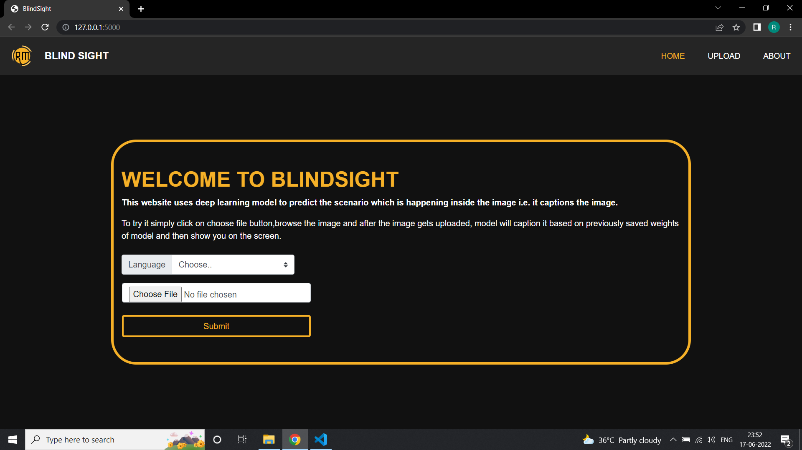
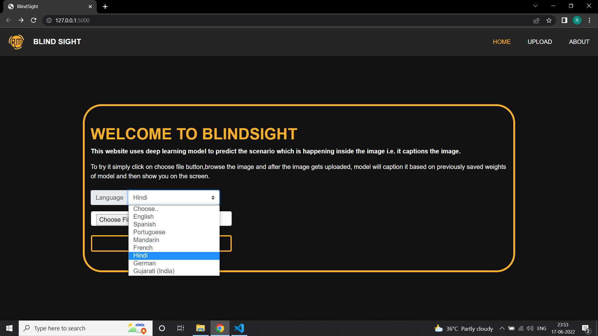
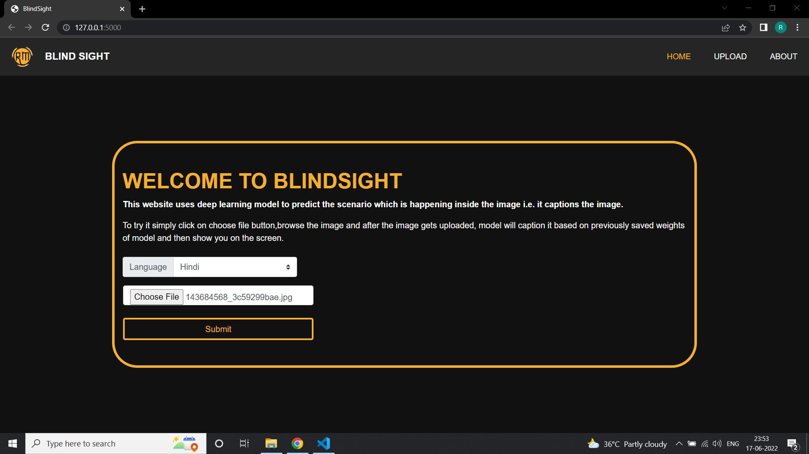
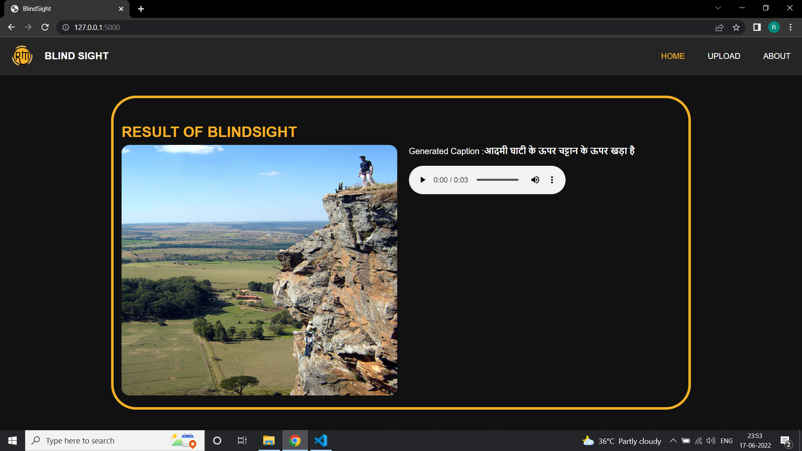

# About BlindSight
In this project, I created a deep learning model that can extract text from any image and render it on the screen. Image and caption related to that image will be given to us in the form of x,y pairs and can be extracted from Flickr8k dataset which I used to build this project, here my goal is to learn some mapping between x and y that is image and their respective captions y=f(x). The basic requirements for creating this model include MLP (Multilayer Perceptron Architecture), Convolution Neural Network, Recurrent Neural Network, Word Embedding’s, Transfer Learning. 

After building this model I have integrated it with web using flask where when a user gives the image as an input then the caption for the image is shown in the desired language with an audio file apeaking the caption in that desired language which user has selected while giving the input.


## For running (Image Captioning Project.ipynb) file
Create a data folder and inside it
Put flicker_8k dataset with images in Images folder and text data in Flickr_TextData folder and install tensolrflow library before running the (Image Captioning Project.ipynb)

## For running the whole application integrated with web
Although you can directly run the flask application after activating the tensorflow environment because we already saved the model weights i.e First activate tensorflow environment.

Eg: For annaconda,if you have installed an environment with name tensorflow
```bash
conda activatetensorflow
```

Then run the flask app using 
```bash
python app.py
```

## Screenshots

 





